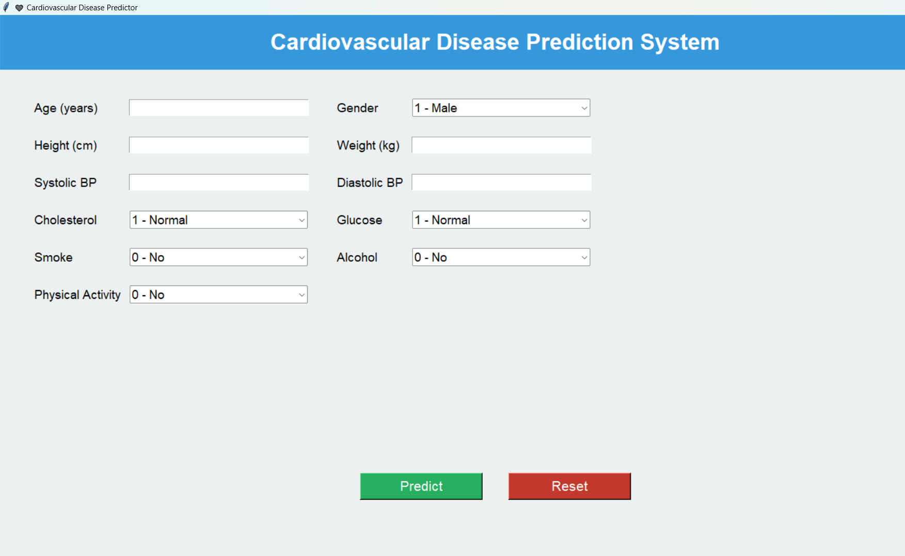
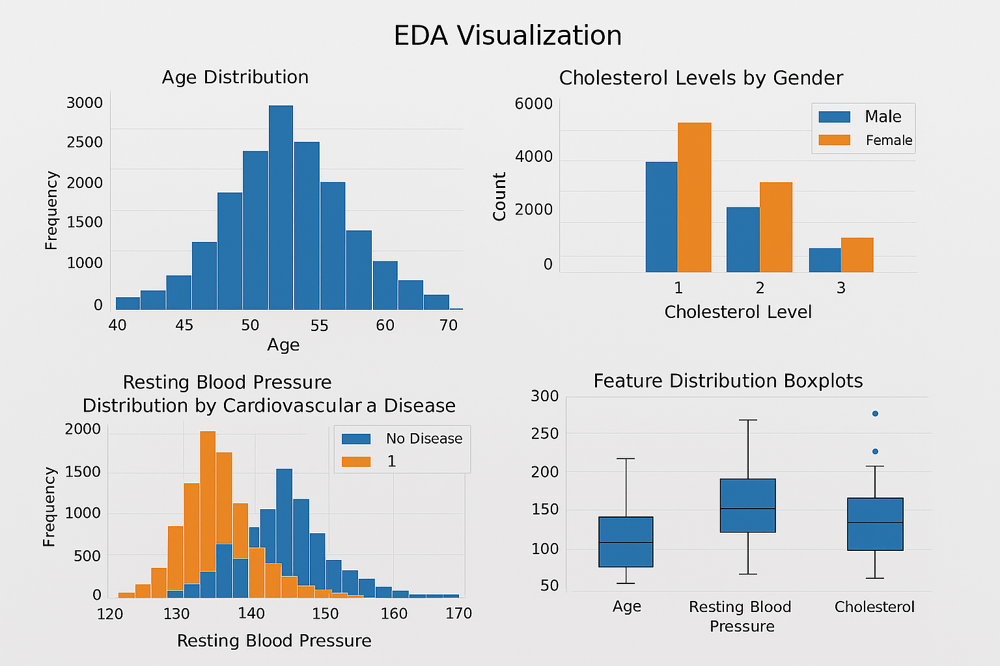
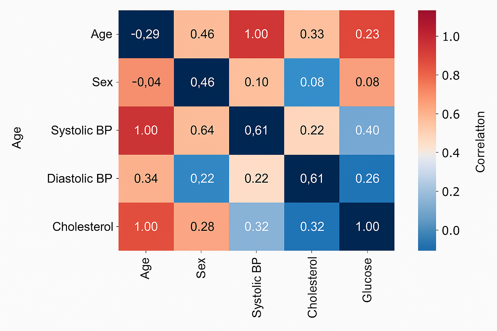

<!-- BANNER -->
<p align="center">
  
</p>

<h1 align="center">❤️ Heart Disease Prediction using Machine Learning</h1>

<p align="center">
  An end-to-end Machine Learning project to predict the likelihood of heart disease using clinical health parameters, complete with a modular ML pipeline and a Tkinter-based GUI.
</p>

---

## 🏷️ Badges

<p align="left">
  
  
  
  
</p>

---

## 📌 Overview

**HeartDiseasePredict** is a complete end-to-end Machine Learning project developed to predict the likelihood of heart disease using clinical health parameters.

The project demonstrates a fully structured ML workflow including:

- Data preprocessing  
- Exploratory Data Analysis (EDA)  
- Correlation and feature importance analysis  
- Model training and comparison  
- Final model selection and saving  
- A Tkinter-based GUI for real-time predictions  

Each step is modularized into separate Python scripts (`step1_preprocessing.py` → `step6_save_model.py`) to ensure clarity, scalability, and a professional project structure.

---

## 📁 Project Structure

```plaintext
HeartDiseasePredict/
│
├── src/
│   ├── heart_gui.py                  # Tkinter GUI for real-time predictions
│   ├── step1_preprocessing.py        # Cleans and preprocesses raw data
│   ├── step2_visualization.py        # Generates EDA plots
│   ├── step3_correlation.py          # Creates correlation heatmaps
│   ├── step4_model_comparison.py     # Trains & compares ML models
│   ├── step5_final_model.py          # Trains the final chosen model
│   └── step6_save_model.py           # Saves model.pkl & scaler.pkl
│
├── data/                             # Contains dataset (local only, ignored in Git)
│   └── cardio_train.csv
│
├── models/                           # Saved ML model and scaler (local only, ignored)
│   ├── model.pkl
│   └── scaler.pkl
│
├── assets/                           # Screenshots & visuals (optional)
│   ├── gui_screenshot.png
│   └── eda_plot.png
│
├── .gitignore                        # Excludes unnecessary folders/files
├── README.md                         # Project documentation (this file)
├── RUN_INSTRUCTIONS.md               # Detailed run commands
└── requirements.txt                  # Python dependencies


## 📸 Screenshots

### 🔹 1. GUI – Heart Disease Prediction Application  


---

### 🔹 2. EDA – Visualization Example  


---

### 🔹 3. Correlation Heatmap  


